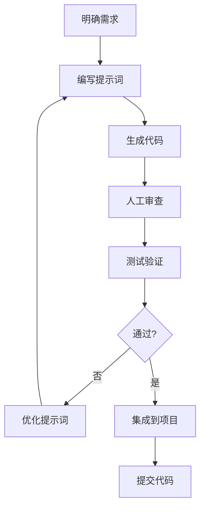

# Claude Code CLI 最佳实践

> **学习时间**: 2026-03-22
> **学习状态**: 🟡 进行中
> **预计完成**: 2026-03-24

---

## 🎯 核心原则

### **1. 清晰的意图表达**
- ✅ 明确描述目标
- ✅ 提供足够上下文
- ✅ 指定约束条件

### **2. 迭代优化**
- ✅ 小步快跑
- ✅ 持续验证
- ✅ 逐步完善

### **3. 人机协作**
- ✅ AI 生成，人工审查
- ✅ AI 建议，人工决策
- ✅ AI 执行，人工验证

---

## 📝 提示词最佳实践

### **1. 结构化提示词**

**模板**:
```markdown
## 背景
<项目背景>

## 目标
<具体目标>

## 约束
- <约束1>
- <约束2>

## 要求
1. <要求1>
2. <要求2>

## 输出格式
<期望的输出格式>
```

**示例**:
```markdown
## 背景
电商平台后端服务，使用 FastAPI + PostgreSQL

## 目标
创建用户注册和登录功能

## 约束
- 使用 JWT 认证
- 密码加密存储（bcrypt）
- 邮箱格式验证

## 要求
1. 遵循 RESTful API 设计
2. 完整的错误处理
3. 单元测试覆盖
4. API 文档

## 输出格式
- 代码文件（带注释）
- 测试文件
- API 文档（Markdown）
```

### **2. 上下文提供**

**❌ 缺乏上下文**:
```bash
claude-code generate --prompt "创建订单系统"
```

**✅ 充分上下文**:
```bash
claude-code generate \
  --context "电商平台，使用微服务架构" \
  --context "订单服务需要与库存服务、支付服务通信" \
  --context "使用事件驱动架构（Kafka）" \
  --context "高并发场景（10k+ QPS）" \
  --prompt "创建订单处理微服务，包含以下功能：
    1. 订单创建（库存检查、价格计算）
    2. 订单支付（支付网关集成）
    3. 订单状态管理（待支付、已支付、已发货、已完成、已取消）
    4. 订单查询（支持分页、过滤）
    5. 事件发布（订单创建、支付完成、发货通知）"
```

### **3. 约束条件**

**技术约束**:
```bash
--constraint "language: python 3.11+"
--constraint "framework: fastapi"
--constraint "database: postgresql"
--constraint "testing: pytest"
--constraint "style: google-python-style-guide"
```

**业务约束**:
```bash
--constraint "response_time: <100ms"
--constraint "availability: 99.9%"
--constraint "concurrent_users: 10000+"
--constraint "data_retention: 7 years"
```

---

## 🔄 工作流最佳实践

### **1. 代码生成工作流**



**实践**:
```bash
# 1. 明确需求
# 2. 编写提示词（结构化）
# 3. 生成代码
claude-code generate --file prompt.md

# 4. 人工审查
# 检查：逻辑、安全、性能、风格

# 5. 测试验证
claude-code test --file generated_code.py
pytest tests/

# 6. 集成
# 合并到主分支
```

### **2. 调试工作流**

```bash
# 1. 复现问题
python app.py

# 2. 收集信息
claude-code debug \
  --file app.py \
  --error "TypeError: 'NoneType' object is not subscriptable" \
  --traceback "Full traceback here" \
  --context "Input data: {...}"

# 3. 分析原因
# Claude Code 会分析并给出建议

# 4. 验证修复
python app.py
```

### **3. 重构工作流**

```bash
# 1. 分析代码质量
claude-code analyze --type quality --file app.py

# 2. 生成重构建议
claude-code refactor \
  --file app.py \
  --style clean-code \
  --focus readability,performance

# 3. 生成测试（确保重构不破坏功能）
claude-code test --file app.py

# 4. 执行重构
# 手动审查并应用建议

# 5. 验证功能
pytest tests/
```

---

## 🎨 代码质量最佳实践

### **1. 代码风格**

**指定风格指南**:
```bash
--style "google-python-style-guide"
--style "airbnb-javascript-style-guide"
--style "rust-api-guidelines"
```

**自动格式化**:
```bash
# 生成时自动格式化
claude-code generate \
  --prompt "..." \
  --format true \
  --linter "flake8,black,mypy"
```

### **2. 测试覆盖**

**生成测试**:
```bash
claude-code test \
  --file app.py \
  --coverage 95 \
  --framework pytest \
  --types "unit,integration,e2e"
```

**测试类型**:
- ✅ 单元测试（unit）
- ✅ 集成测试（integration）
- ✅ 端到端测试（e2e）
- ✅ 性能测试（performance）
- ✅ 安全测试（security）

### **3. 文档生成**

**自动生成文档**:
```bash
claude-code doc \
  --file app.py \
  --type "api,readme,docstring" \
  --format markdown
```

**文档类型**:
- API 文档
- README
- 代码注释
- 使用示例

---

## ⚡ 性能优化最佳实践

### **1. 性能分析**

```bash
# 分析瓶颈
claude-code analyze \
  --type performance \
  --file app.py \
  --metrics "time,memory,cpu"

# 生成报告
# 输出：瓶颈位置、优化建议
```

### **2. 优化策略**

**常见优化**:
```bash
# 数据库优化
--optimize "database:indexing,query-optimization"

# 缓存策略
--optimize "cache:redis,in-memory"

# 并发处理
--optimize "concurrency:async,multiprocessing"

# 算法优化
--optimize "algorithm:time-complexity,space-complexity"
```

### **3. 基准测试**

```bash
claude-code benchmark \
  --file app.py \
  --iterations 1000 \
  --warmup 100 \
  --output benchmark_report.md
```

---

## 🔒 安全最佳实践

### **1. 安全审计**

```bash
claude-code security \
  --scan full \
  --file app.py \
  --check "sql-injection,xss,csrf,auth-bypass"
```

### **2. 安全编码**

**常见安全问题**:
- ❌ SQL 注入
- ❌ XSS（跨站脚本）
- ❌ CSRF（跨站请求伪造）
- ❌ 认证绕过
- ❌ 敏感信息泄露

**安全要求**:
```bash
--security "input-validation"
--security "parameterized-queries"
--security "output-encoding"
--security "csrf-tokens"
--security "secure-headers"
```

### **3. 密钥管理**

**❌ 错误做法**:
```python
API_KEY = "sk-1234567890abcdef"
```

**✅ 正确做法**:
```python
import os
API_KEY = os.environ.get("API_KEY")
```

---

## 🚀 CI/CD 集成最佳实践

### **1. GitHub Actions**

```yaml
name: Claude Code CI

on: [push, pull_request]

jobs:
  test:
    runs-on: ubuntu-latest
    steps:
      - uses: actions/checkout@v3

      - name: Generate Code
        run: |
          claude-code generate --file prompt.md

      - name: Run Tests
        run: |
          claude-code test --coverage 95

      - name: Security Scan
        run: |
          claude-code security --scan full

      - name: Deploy
        run: |
          # 部署逻辑
```

### **2. Pre-commit Hooks**

```bash
#!/bin/bash
# .git/hooks/pre-commit

# 1. 代码生成检查
claude-code validate --file changed_files.txt

# 2. 测试运行
claude-code test --quick

# 3. 安全检查
claude-code security --scan quick

# 4. 文档生成
claude-code doc --update
```

---

## 📊 监控和日志最佳实践

### **1. 日志记录**

```bash
claude-code generate \
  --prompt "..." \
  --logging "structured" \
  --log-level "INFO" \
  --log-format "json"
```

### **2. 性能监控**

```bash
--monitoring "prometheus"
--metrics "latency,throughput,error-rate"
--alerts "high-latency,high-error-rate"
```

### **3. 错误追踪**

```bash
--error-tracking "sentry"
--error-handling "graceful"
--fallback-strategy "circuit-breaker"
```

---

## 🎓 学习资源

### **官方资源**
- [Claude Code 官方文档](https://docs.anthropic.com/claude/docs/claude-code)
- [最佳实践指南](https://docs.anthropic.com/claude/docs/best-practices)
- [示例代码](https://github.com/anthropics/claude-code-examples)

### **社区资源**
- YouTube 教程（待整理）
- 社区案例（待整理）
- 最佳实践分享（待整理）

---

## 📝 检查清单

### **代码生成前**
- [ ] 明确需求
- [ ] 准备上下文
- [ ] 定义约束条件
- [ ] 指定输出格式

### **代码生成后**
- [ ] 人工审查
- [ ] 测试验证
- [ ] 性能测试
- [ ] 安全检查

### **部署前**
- [ ] 代码审查
- [ ] 测试覆盖（95%+）
- [ ] 性能基准
- [ ] 安全审计
- [ ] 文档完整

---

**学习进度**: 0% | ⏳ 未开始
**下次更新**: 2026-03-24
