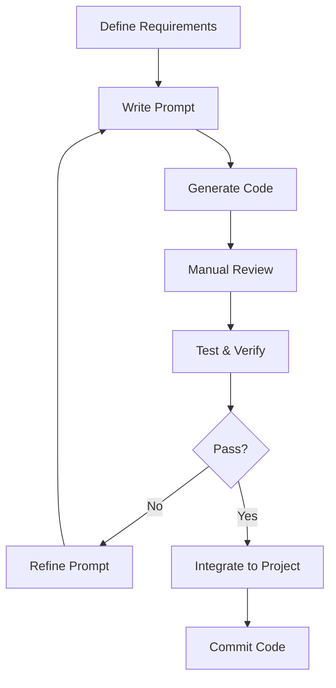

# Claude Code CLI Best Practices

> **Learning Date**: 2026-03-22
> **Status**: 🟡 In Progress
> **Expected Completion**: 2026-03-24

---

## 🎯 Core Principles

### **1. Clear Intent Expression**
- ✅ Clearly describe goals
- ✅ Provide sufficient context
- ✅ Specify constraints

### **2. Iterative Optimization**
- ✅ Small, rapid iterations
- ✅ Continuous validation
- ✅ Progressive refinement

### **3. Human-AI Collaboration**
- ✅ AI generates, human reviews
- ✅ AI suggests, human decides
- ✅ AI executes, human verifies

---

## 📝 Prompt Best Practices

### **1. Structured Prompts**

**Template**:
```markdown
## Background
<project background>

## Goal
<specific goal>

## Constraints
- <constraint 1>
- <constraint 2>

## Requirements
1. <requirement 1>
2. <requirement 2>

## Output Format
<expected output format>
```

**Example**:
```markdown
## Background
E-commerce platform backend service using FastAPI + PostgreSQL

## Goal
Create user registration and login functionality

## Constraints
- Use JWT authentication
- Password encryption (bcrypt)
- Email format validation

## Requirements
1. Follow RESTful API design
2. Complete error handling
3. Unit test coverage
4. API documentation

## Output Format
- Code files (with comments)
- Test files
- API documentation (Markdown)
```

### **2. Context Provision**

**❌ Insufficient Context**:
```bash
claude-code generate --prompt "Create order system"
```

**✅ Sufficient Context**:
```bash
claude-code generate \
  --context "E-commerce platform using microservices architecture" \
  --context "Order service needs to communicate with inventory and payment services" \
  --context "Using event-driven architecture (Kafka)" \
  --context "High concurrency scenario (10k+ QPS)" \
  --prompt "Create order processing microservice with the following features:
    1. Order creation (inventory check, price calculation)
    2. Order payment (payment gateway integration)
    3. Order status management (pending, paid, shipped, completed, cancelled)
    4. Order query (pagination, filtering support)
    5. Event publishing (order created, payment completed, shipping notification)"
```

### **3. Constraint Specification**

**Technical Constraints**:
```bash
--constraint "language: python 3.11+"
--constraint "framework: fastapi"
--constraint "database: postgresql"
--constraint "testing: pytest"
--constraint "style: google-python-style-guide"
```

**Business Constraints**:
```bash
--constraint "response_time: <100ms"
--constraint "availability: 99.9%"
--constraint "concurrent_users: 10000+"
--constraint "data_retention: 7 years"
```

---

## 🔄 Workflow Best Practices

### **1. Code Generation Workflow**



**Practice**:
```bash
# 1. Define requirements
# 2. Write prompt (structured)
# 3. Generate code
claude-code generate --file prompt.md

# 4. Manual review
# Check: logic, security, performance, style

# 5. Test & verify
claude-code test --file generated_code.py
pytest tests/

# 6. Integration
# Merge to main branch
```

### **2. Debugging Workflow**

```bash
# 1. Reproduce issue
python app.py

# 2. Collect information
claude-code debug \
  --file app.py \
  --error "TypeError: 'NoneType' object is not subscriptable" \
  --traceback "Full traceback here" \
  --context "Input data: {...}"

# 3. Analyze cause
# Claude Code will analyze and provide suggestions

# 4. Verify fix
python app.py
```

### **3. Refactoring Workflow**

```bash
# 1. Analyze code quality
claude-code analyze --type quality --file app.py

# 2. Generate refactoring suggestions
claude-code refactor \
  --file app.py \
  --style clean-code \
  --focus readability,performance

# 3. Generate tests (ensure refactoring doesn't break functionality)
claude-code test --file app.py

# 4. Execute refactoring
# Manually review and apply suggestions

# 5. Verify functionality
pytest tests/
```

---

## 🎨 Code Quality Best Practices

### **1. Code Style**

**Specify Style Guide**:
```bash
--style "google-python-style-guide"
--style "airbnb-javascript-style-guide"
--style "rust-api-guidelines"
```

**Auto-Formatting**:
```bash
# Auto-format during generation
claude-code generate \
  --prompt "..." \
  --format true \
  --linter "flake8,black,mypy"
```

### **2. Test Coverage**

**Generate Tests**:
```bash
claude-code test \
  --file app.py \
  --coverage 95 \
  --framework pytest \
  --types "unit,integration,e2e"
```

**Test Types**:
- ✅ Unit tests
- ✅ Integration tests
- ✅ End-to-end tests
- ✅ Performance tests
- ✅ Security tests

### **3. Documentation Generation**

**Auto-Generate Documentation**:
```bash
claude-code doc \
  --file app.py \
  --type "api,readme,docstring" \
  --format markdown
```

**Documentation Types**:
- API documentation
- README
- Code comments
- Usage examples

---

## ⚡ Performance Optimization Best Practices

### **1. Performance Analysis**

```bash
# Analyze bottlenecks
claude-code analyze \
  --type performance \
  --file app.py \
  --metrics "time,memory,cpu"

# Generate report
# Output: bottleneck locations, optimization suggestions
```

### **2. Optimization Strategies**

**Common Optimizations**:
```bash
# Database optimization
--optimize "database:indexing,query-optimization"

# Caching strategy
--optimize "cache:redis,in-memory"

# Concurrency handling
--optimize "concurrency:async,multiprocessing"

# Algorithm optimization
--optimize "algorithm:time-complexity,space-complexity"
```

### **3. Benchmarking**

```bash
claude-code benchmark \
  --file app.py \
  --iterations 1000 \
  --warmup 100 \
  --output benchmark_report.md
```

---

## 🔒 Security Best Practices

### **1. Security Auditing**

```bash
claude-code security \
  --scan full \
  --file app.py \
  --check "sql-injection,xss,csrf,auth-bypass"
```

### **2. Secure Coding**

**Common Security Issues**:
- ❌ SQL injection
- ❌ XSS (Cross-Site Scripting)
- ❌ CSRF (Cross-Site Request Forgery)
- ❌ Authentication bypass
- ❌ Sensitive information leakage

**Security Requirements**:
```bash
--security "input-validation"
--security "parameterized-queries"
--security "output-encoding"
--security "csrf-tokens"
--security "secure-headers"
```

### **3. Secret Management**

**❌ Wrong Approach**:
```python
API_KEY = "sk-1234567890abcdef"
```

**✅ Correct Approach**:
```python
import os
API_KEY = os.environ.get("API_KEY")
```

---

## 🚀 CI/CD Integration Best Practices

### **1. GitHub Actions**

```yaml
name: Claude Code CI

on: [push, pull_request]

jobs:
  test:
    runs-on: ubuntu-latest
    steps:
      - uses: actions/checkout@v3

      - name: Generate Code
        run: |
          claude-code generate --file prompt.md

      - name: Run Tests
        run: |
          claude-code test --coverage 95

      - name: Security Scan
        run: |
          claude-code security --scan full

      - name: Deploy
        run: |
          # Deployment logic
```

### **2. Pre-commit Hooks**

```bash
#!/bin/bash
# .git/hooks/pre-commit

# 1. Code generation check
claude-code validate --file changed_files.txt

# 2. Run tests
claude-code test --quick

# 3. Security check
claude-code security --scan quick

# 4. Generate documentation
claude-code doc --update
```

---

## 📊 Monitoring and Logging Best Practices

### **1. Logging**

```bash
claude-code generate \
  --prompt "..." \
  --logging "structured" \
  --log-level "INFO" \
  --log-format "json"
```

### **2. Performance Monitoring**

```bash
--monitoring "prometheus"
--metrics "latency,throughput,error-rate"
--alerts "high-latency,high-error-rate"
```

### **3. Error Tracking**

```bash
--error-tracking "sentry"
--error-handling "graceful"
--fallback-strategy "circuit-breaker"
```

---

## 🎓 Learning Resources

### **Official Resources**
- [Claude Code Official Documentation](https://docs.anthropic.com/claude/docs/claude-code)
- [Best Practices Guide](https://docs.anthropic.com/claude/docs/best-practices)
- [Example Code](https://github.com/anthropics/claude-code-examples)

### **Community Resources**
- YouTube tutorials (To be organized)
- Community case studies (To be organized)
- Best practices sharing (To be organized)

---

## 📝 Checklists

### **Before Code Generation**
- [ ] Define requirements clearly
- [ ] Prepare context
- [ ] Define constraints
- [ ] Specify output format

### **After Code Generation**
- [ ] Manual review
- [ ] Test verification
- [ ] Performance testing
- [ ] Security check

### **Before Deployment**
- [ ] Code review
- [ ] Test coverage (95%+)
- [ ] Performance benchmarks
- [ ] Security audit
- [ ] Complete documentation

---

**Learning Progress**: 0% | ⏳ Not Started
**Next Update**: 2026-03-24
