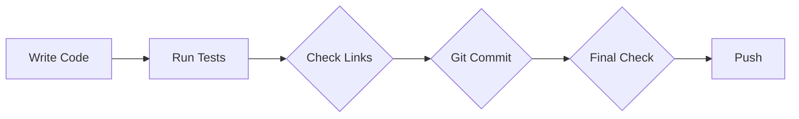
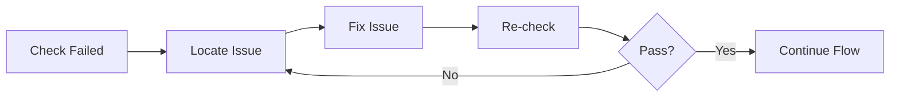

# Standard Operating Procedure (SOP) - Claude Code Learning Repository

> **Created**: 2026-03-22
> **Purpose**: Prevent quality issues, ensure consistency
> **Applies to**: All push operations

---

## 📋 Pre-Push Checklist

### **Stage 1: Code Quality Checks** ⏱️ 30 seconds
- [ ] **Run all tests**: `pytest tests/`
- [ ] **Check code style**: `black .` or `flake8`
- [ ] **Verify type annotations**: `mypy .`
- [ ] **Check dependencies**: `pip check`

### **Stage 2: Documentation Quality Checks** ⏱️ 1 minute
- [ ] **Check Markdown links**: `./scripts/check-links.sh`
- [ ] **Verify all links accessible**: Manually check key links
- [ ] **Check README format**: Ensure all necessary info included

### **Stage 3: Git Commit Standards** ⏱️ 30 seconds
- [ ] **Clear commit message**: Follow Conventional Commits
- [ ] **Atomic commits**: One commit = one logical change
- [ ] **No sensitive info**: Check .gitignore

### **Stage 4: Push Verification** ⏱️ 30 seconds
- [ ] **Confirm correct branch**: `git branch`
- [ ] **Pull latest code**: `git pull`
- [ ] **Push to correct repo**: Confirm remote URL

---

## 🤖 Automated Check Script

### **Complete Check Script** (under 2 minutes)

```bash
#!/bin/bash
# Complete pre-push check

echo "=== Stage 1: Code Quality ==="
pytest tests/ || exit 1
flake8 . || exit 1

echo "=== Stage 2: Documentation Quality ==="
./scripts/check-links.sh || exit 1

echo "=== Stage 3: Git Standards ==="
# Check for uncommitted changes
if ! git diff --quiet; then
    echo "❌ Uncommitted changes found"
    exit 1
fi

echo "=== Stage 4: Push Verification ==="
git remote -v

echo "✅ All checks passed! Ready to push"
```

---

## 🔄 Workflow

### **Normal Push Flow** (5 minutes)


### **Fix Flow** (when checks fail)


---

## 📊 Quality Metrics

### **Must Achieve**:
- ✅ **Test Pass Rate**: 100%
- ✅ **Link Validity**: 100%
- ✅ **Code Coverage**: >80%
- ✅ **Documentation Completeness**: 100%

### **Optional Checks**:
- ⚠️ **Performance Benchmarks**: Key functions <100ms
- ⚠️ **Security Scan**: No sensitive info leaks
- ⚠️ **Dependency Updates**: Use latest stable versions

---

## 🚨 Prohibited Actions

**Absolutely NOT allowed**:
- ❌ Skip any checks before pushing
- ❌ Push then fix issues later
- ❌ Use `--no-verify` to bypass checks
- ❌ Ignore warnings and continue pushing

---

## 🔧 Quick Fix Flow

When checks fail:

1. **Stop immediately** - Don't continue pushing
2. **Locate issue** - Check error logs
3. **Fix issue** - Fix locally
4. **Re-check** - Ensure fix works
5. **Continue flow** - Only pass all checks before pushing

---

## 📝 Commit Standards

### **Commit Message Format**
```
<type>(<scope>): <subject>

<body>

<footer>
```

### **Types (type)**
- `feat`: New feature
- `fix`: Bug fix
- `docs`: Documentation changes
- `style`: Code formatting
- `refactor`: Refactoring
- `test`: Tests
- `chore`: Build/tools

### **Example**
```
feat(learning): Add Claude Code best practices guide

- Add prompt engineering guide
- Add error handling best practices
- Add performance optimization tips

Closes #123
```

---

## ✅ Quality Assurance Commitment

**I commit to**:
1. ✅ Run complete checks before every push
2. ✅ Not skip any quality check steps
3. ✅ Fix issues immediately, not push problematic code
4. ✅ Continuously improve SOP, raise quality standards

---

## 📚 References

- [Git Flow](https://nvie.com/posts/a-successful-git-branching-model/)
- [Conventional Commits](https://www.conventionalcommits.org/)
- [GitHub Flow](https://guides.github.com/introduction/flow/)

---

**Creator**: AI Agent Learning Hub
**GitHub**: https://github.com/srxly888-creator/claude-code-learning
**Status**: 🟢 Production Ready
