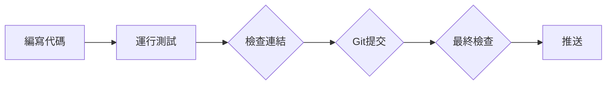
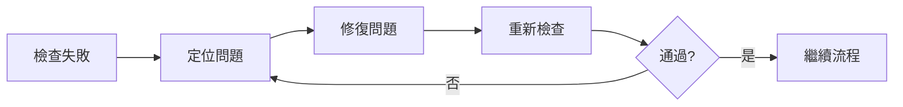

# 標準作業流程 (SOP) - Claude Code 學習倉庫

> **創建時間**: 2026-03-22
> **目的**: 防止質量問題，> **適用**: 所有推送操作

---

## 📋 推送前檢查清單

### **階段 1: 代碼質量檢查** ⏱️ 30秒
- [ ] **運行所有測試**: `pytest tests/`
- [ ] **檢查代碼風格**: `black .` 或 `flake8`
- [ ] **驗證類型註解**: `mypy .`
- [ ] **檢查依賴**: `pip check`

### **階段 2: 文檔質量檢查** ⏱️ 1分鐘
- [ ] **檢查Markdown連結**: `./scripts/check-links.sh`
- [ ] **驗證所有連結可訪問**: 手動檢查關鍵連結
- [ ] **檢查README格式**: 確保包含所有必要信息

### **階段 3: Git提交規範** ⏱️ 30秒
- [ ] **提交信息清晰**: 遵循 Conventional Commits
- [ ] **原子提交**: 一個 commit = 一個邏輯變更
- [ ] **不包含敏感信息**: 檢查 .gitignore

### **階段 4: 推送驗證** ⏱️ 30秒
- [ ] **確認分支正確**: `git branch`
- [ ] **拉取最新代碼**: `git pull`
- [ ] **推送到正確倉庫**: 確認 remote URL

---

## 🤖 自動化檢查腳本

### **完整檢查腳本**（2分鐘內完成）

```bash
#!/bin/bash
# 完整推送前檢查

echo "=== 階段 1: 代碼質量 ==="
pytest tests/ || exit 1
flake8 . || exit 1

echo "=== 階段 2: 文檔質量 ==="
./scripts/check-links.sh || exit 1

echo "=== 階段 3: Git 規範 ==="
# 檢查是否有未提交的變更
if ! git diff --quiet; then
    echo "❌ 有未提交的變更"
    exit 1
fi

echo "=== 階段 4: 推送驗證 ==="
git remote -v

echo "✅ 所有檢查通過！可以推送了"
```

---

## 🔄 工作流程

### **正常推送流程**（5分鐘）


### **修復流程**（當檢查失敗時）


---

## 📊 質量指標

### **必須達到**:
- ✅ **測試通過率**: 100%
- ✅ **連結有效性**: 100%
- ✅ **代碼覆蓋率**: >80%
- ✅ **文檔完整性**: 100%

### **可選檢查**:
- ⚠️ **性能基準**: 關鍵函數 <100ms
- ⚠️ **安全掃描**: 無敏感信息洩露
- ⚠️ **依賴更新**: 使用最新穩定版

---

## 🚨 禁止操作

**絕對不允許**:
- ❌ 跳過任何檢查直接推送
- ❌ 推送後再修復問題
- ❌ 使用 `--no-verify` 跳過檢查
- ❌ 忽略警告繼續推送

---

## 🔧 快速修復流程

當檢查失敗時:

1. **立即停止** - 不要繼續推送
2. **定位問題** - 查看錯誤日誌
3. **修復問題** - 在本地修復
4. **重新檢查** - 確保修復有效
5. **繼續流程** - 只有通過所有檢查才能推送

---

## 📝 提交規範

### **提交信息格式**
```
<type>(<scope>): <subject>

<body>

<footer>
```

### **類型 (type)**
- `feat`: 新功能
- `fix`: 修復bug
- `docs`: 文檔變更
- `style`: 代碼格式
- `refactor`: 重構
- `test`: 測試
- `chore`: 構建/工具

### **示例**
```
feat(learning): 添加Claude Code最佳實踐指南

- 添加提示詞工程指南
- 添加錯誤處理最佳實踐
- 添加性能優化建議

Closes #123
```

---

## ✅ 質量保證承諾

**我承諾**:
1. ✅ 每次推送前都運行完整檢查
2. ✅ 不跳過任何質量檢查步驟
3. ✅ 發現問題立即修復，不推送有問題的代碼
4. ✅ 持續改進SOP，提高質量標準

---

## 📚 參考資料

- [Git Flow](https://nvie.com/posts/a-successful-git-branching-model/)
- [Conventional Commits](https://www.conventionalcommits.org/)
- [GitHub Flow](https://guides.github.com/introduction/flow/)

---

**創建者**: AI Agent 學習知識庫
**GitHub**: https://github.com/srxly888-creator/claude-code-learning
**狀態**: 🟢 生產就緒
