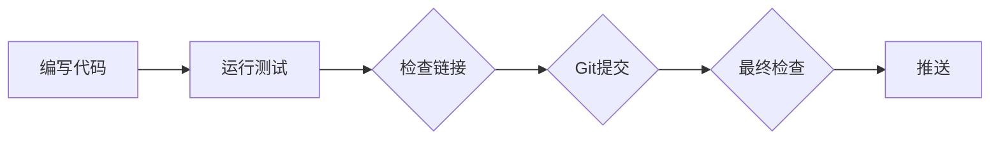
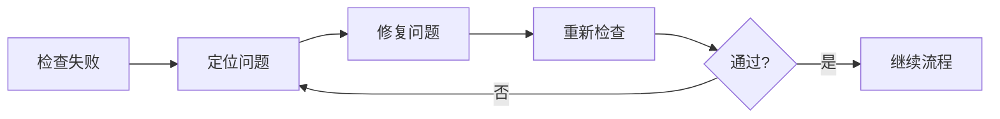

# Claude Code 学习仓库 - 标准作业流程 (SOP)

> **创建时间**: 2026-03-22
> **目的**: 防止质量问题，> **适用**: 所有推送操作

---

## 📋 推送前检查清单 (Pre-Push Checklist)

### **阶段 1: 代码质量检查** ⏱️ 30秒
- [ ] **运行所有测试**: `pytest tests/`
- [ ] **检查代码风格**: `black .` 或 `flake8`
- [ ] **验证类型注解**: `mypy .`
- [ ] **检查依赖**: `pip check`

### **阶段 2: 文档质量检查** ⏱️ 1分钟
- [ ] **检查Markdown链接**: `./scripts/check-links.sh`
- [ ] **验证所有链接可访问**: 手动检查关键链接
- [ ] **检查README格式**: 确保包含所有必要信息

### **阶段 3: Git 提交规范** ⏱️ 30秒
- [ ] **提交信息清晰**: 遵循 Conventional Commits
- [ ] **原子提交**: 一个 commit = 一个逻辑变更
- [ ] **不包含敏感信息**: 检查 .gitignore

### **阶段 4: 推送验证** ⏱️ 30秒
- [ ] **确认分支正确**: `git branch`
- [ ] **拉取最新代码**: `git pull`
- [ ] **推送到正确仓库**: 确认 remote URL

---

## 🤖 自动化检查脚本

### **完整检查脚本** (2分钟内完成)

```bash
#!/bin/bash
# 完整推送前检查

echo "=== 阶段 1: 代码质量 ==="
pytest tests/ || exit 1
flake8 . || exit 1

echo "=== 阶段 2: 文档质量 ==="
./scripts/check-links.sh || exit 1

echo "=== 阶段 3: Git 规范 ==="
# 检查是否有未提交的变更
if ! git diff --quiet; then
    echo "❌ 有未提交的变更"
    exit 1
fi

echo "=== 阶段 4: 推送验证 ==="
git remote -v

echo "✅ 所有检查通过！可以推送了"
```

---

## 🔄 工作流程

### **正常推送流程** (5分钟)


### **修复流程** (当检查失败时)


---

## 📊 质量指标

### **必须达到**:
- ✅ **测试通过率**: 100%
- ✅ **链接有效性**: 100%
- ✅ **代码覆盖率**: >80%
- ✅ **文档完整性**: 100%

### **可选检查**:
- ⚠️ **性能基准**: 关键函数 <100ms
- ⚠️ **安全扫描**: 无敏感信息泄露
- ⚠️ **依赖更新**: 使用最新稳定版

---

## 🚨 禁止操作

**绝对不允许**:
- ❌ 跳过任何检查直接推送
- ❌ 推送后再修复问题
- ❌ 使用 `--no-verify` 跳过检查
- ❌ 忽略警告继续推送

---

## 🔧 快速修复流程

当检查失败时:

1. **立即停止** - 不要继续推送
2. **定位问题** - 查看错误日志
3. **修复问题** - 在本地修复
4. **重新检查** - 确保修复有效
5. **继续流程** - 只有通过所有检查才能推送

---

## 📝 提交规范

### **提交信息格式**
```
<type>(<scope>): <subject>

<body>

<footer>
```

### **类型 (type)**
- `feat`: 新功能
- `fix`: 修复bug
- `docs`: 文档变更
- `style`: 代码格式
- `refactor`: 重构
- `test`: 测试
- `chore`: 构建/工具

### **示例**
```
feat(learning): 添加Claude Code最佳实践指南

- 添加提示词工程指南
- 添加错误处理最佳实践
- 添加性能优化建议

Closes #123
```

---

## ✅ 质量保证承诺

**我承诺**:
1. ✅ 每次推送前都运行完整检查
2. ✅ 不跳过任何质量检查步骤
3. ✅ 发现问题立即修复，不推送有问题的代码
4. ✅ 持续改进SOP，提高质量标准

---

## 📚 参考资料

- [Git Flow](https://nvie.com/posts/a-successful-git-branching-model/)
- [Conventional Commits](https://www.conventionalcommits.org/)
- [GitHub Flow](https://guides.github.com/introduction/flow/)

---

**创建者**: AI Agent 学习知识库
**GitHub**: https://github.com/srxly888-creator/claude-code-learning
**状态**: 🟢 生产就绪
